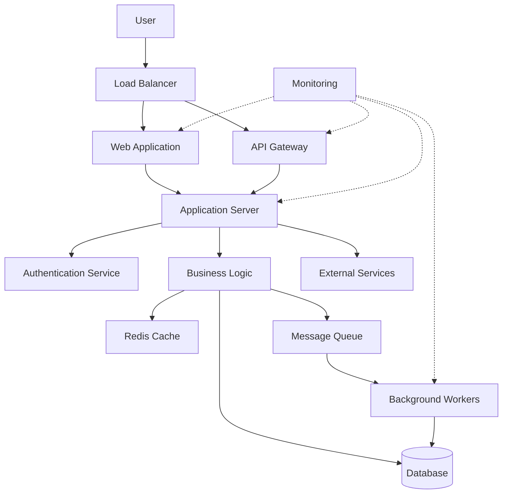
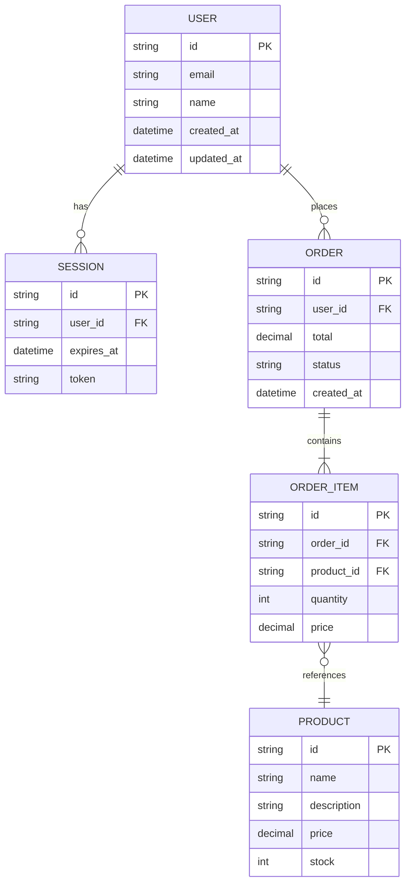
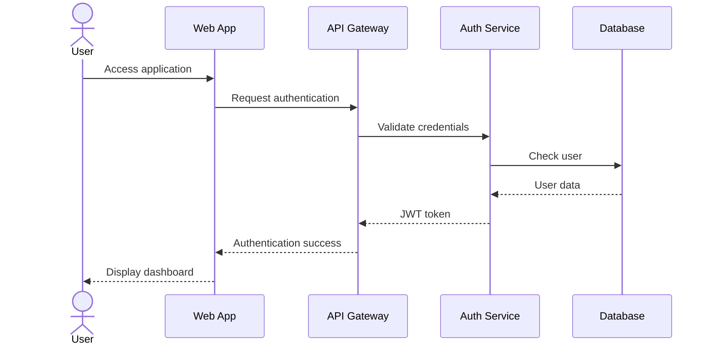
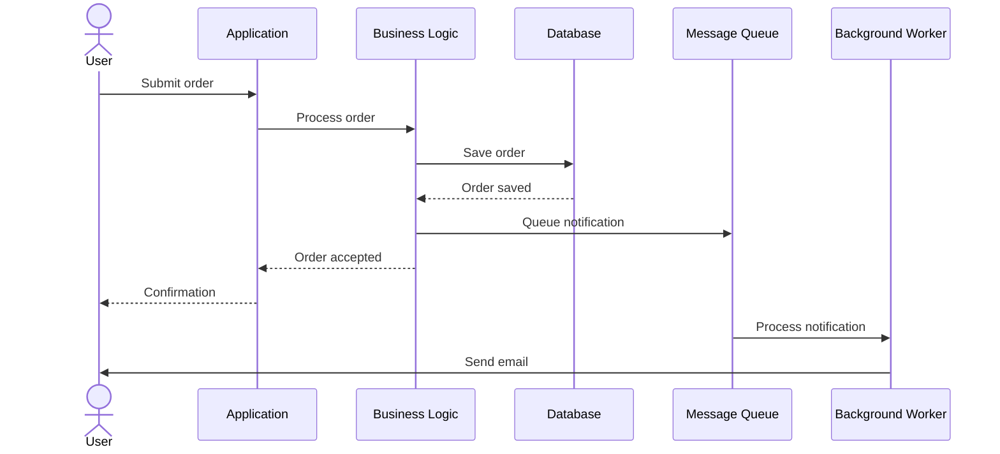

# Software Design Document - E-Commerce Platform

## Document Metadata

- **Version:** 1.0
- **Date:** 2025-10-12
- **Author:** SDD Generator - Grok 4 Heavy
- **Status:** Draft

## Executive Summary

This document describes the software design for E-Commerce Platform.

**Project Overview:** A modern e-commerce platform for selling products online

**Target Users:** End consumers (B2C)

**Architecture:** Microservices deployed on AWS

**Key Objectives:**
- Deliver a scalable, secure, and maintainable solution
- Meet specified performance and availability requirements
- Ensure compliance with security and privacy standards
- Provide excellent user experience

This design prioritizes security, scalability, and operational excellence while balancing cost and development velocity.

## Assumptions Register and Confidence

| ID | Description | Confidence | Source | Section |
|----|-------------|------------|--------|---------|
| ASM-001 | Deployment will use managed services from AWS | High | User specified | Deployment |

**Confidence Levels:**
- **High:** Well-validated, low risk
- **Medium:** Reasonable assumption, moderate risk
- **Low:** Uncertain, requires validation

## Decision Log

### DEC-001: Use AWS as primary cloud provider

**Rationale:** Selected based on user requirements and organizational alignment

**Alternatives Considered:**
- AWS
- Azure
- GCP
- On-Premise

**Impact:** High - affects all infrastructure decisions

**Timestamp:** 2025-10-12T13:10:24.004296

### DEC-002: Adopt Microservices architecture pattern

**Rationale:** Aligns with project requirements and team expertise

**Alternatives Considered:**
- Monolithic
- Microservices
- Serverless
- Event-driven

**Impact:** High - defines overall system structure

**Timestamp:** 2025-10-12T13:10:24.004307


## Trade-off Table

| Aspect | Option A | Option B | Chosen | Rationale |
|--------|----------|----------|--------|-----------|
| Architecture Complexity | Microservices | Monolithic | Microservices | Better scalability and team autonomy vs simpler operations |
| Database | SQL (PostgreSQL) | NoSQL (DynamoDB) | SQL (PostgreSQL) | ACID compliance and complex queries vs horizontal scalability |
| Deployment | Kubernetes | Managed Services | Managed Services | Less operational overhead vs more control and portability |

## Architecture Overview

The system follows a Microservices architecture pattern.

**Key Architectural Principles:**
- **Scalability:** Design for horizontal scaling
- **Security:** Security-first approach with defense in depth
- **Resilience:** Design for failure with graceful degradation
- **Observability:** Comprehensive monitoring and logging
- **Maintainability:** Clear separation of concerns and modular design

**High-Level Architecture:**
The system is decomposed into the following layers:
- **Presentation Layer:** User-facing interfaces (web, mobile, API)
- **Application Layer:** Business logic and orchestration
- **Data Layer:** Persistent storage and caching
- **Integration Layer:** External service integrations


### Architecture Diagram





## Components

### API Gateway

**Responsibility:** Request routing, authentication, rate limiting

**Technology:** AWS API Gateway / Azure API Management

**Interfaces:** REST API, WebSocket

### Application Server

**Responsibility:** Business logic execution, orchestration

**Technology:** Node.js / Python / Java

**Interfaces:** Internal APIs

### Database

**Responsibility:** Persistent data storage

**Technology:** PostgreSQL / DynamoDB

**Interfaces:** Database protocol

### Cache

**Responsibility:** High-speed data caching

**Technology:** Redis / Memcached

**Interfaces:** Cache protocol

### Message Queue

**Responsibility:** Asynchronous task processing

**Technology:** RabbitMQ / AWS SQS

**Interfaces:** Queue protocol


## Data Model





## API Design


```yaml
openapi: 3.1.0
info:
  title: E-Commerce Platform API
  version: 1.0.0
  description: API for E-Commerce Platform

servers:
  - url: https://api.example.com/v1
    description: Production server

paths:
  /users:
    get:
      summary: List users
      operationId: listUsers
      tags:
        - users
      parameters:
        - name: limit
          in: query
          schema:
            type: integer
            default: 20
      responses:
        '200':
          description: Successful response
          content:
            application/json:
              schema:
                type: object
                properties:
                  users:
                    type: array
                    items:
                      $ref: '#/components/schemas/User'
        '401':
          $ref: '#/components/responses/UnauthorizedError'
    
    post:
      summary: Create user
      operationId: createUser
      tags:
        - users
      requestBody:
        required: true
        content:
          application/json:
            schema:
              $ref: '#/components/schemas/UserCreate'
      responses:
        '201':
          description: User created
          content:
            application/json:
              schema:
                $ref: '#/components/schemas/User'

components:
  schemas:
    User:
      type: object
      required:
        - id
        - email
      properties:
        id:
          type: string
          format: uuid
        email:
          type: string
          format: email
        name:
          type: string
        created_at:
          type: string
          format: date-time
    
    UserCreate:
      type: object
      required:
        - email
        - name
      properties:
        email:
          type: string
          format: email
        name:
          type: string
  
  responses:
    UnauthorizedError:
      description: Authentication required
      content:
        application/json:
          schema:
            type: object
            properties:
              error:
                type: string

  securitySchemes:
    bearerAuth:
      type: http
      scheme: bearer
      bearerFormat: JWT

security:
  - bearerAuth: []
```


## User Flows

### Flow 1





### Flow 2





## Non-Functional Requirements

**Performance:** System must meet 10K-100K users p95 200ms 99.95%. Response times under 500ms for 95th percentile.

**Scalability:** Support horizontal scaling to handle 10x traffic growth

**Availability:** 99.9% uptime SLA (8.76 hours downtime per year)

**Reliability:** Mean Time Between Failures (MTBF) > 720 hours

**Maintainability:** Code coverage > 80%, automated deployments

**Security:** SOC 2 Type II compliance, encryption at rest and in transit

**Usability:** WCAG 2.1 AA compliance, responsive design

**Portability:** Cloud-agnostic design where feasible


## Security and Privacy

Data Classification: Restricted. Compliance: GDPR, SOC 2, ISO 27001

### STRIDE Threat Model


**STRIDE Threat Model:**
- **Spoofing:** Mitigated by multi-factor authentication (MFA)
- **Tampering:** Mitigated by input validation and integrity checks
- **Repudiation:** Mitigated by comprehensive audit logging
- **Information Disclosure:** Mitigated by encryption and access controls
- **Denial of Service:** Mitigated by rate limiting and DDoS protection
- **Elevation of Privilege:** Mitigated by principle of least privilege


### OWASP ASVS Compliance


**OWASP ASVS Compliance:**
- V1: Architecture, Design and Threat Modeling (Level 2)
- V2: Authentication (Level 2)
- V3: Session Management (Level 2)
- V4: Access Control (Level 2)
- V7: Error Handling and Logging (Level 2)
- V8: Data Protection (Level 2)
- V9: Communications (Level 2)


### SOC 2 Trust Services Criteria


**SOC 2 Trust Services Criteria:**
- CC1: Control Environment
- CC2: Communication and Information
- CC3: Risk Assessment
- CC4: Monitoring Activities
- CC5: Control Activities
- CC6: Logical and Physical Access Controls
- CC7: System Operations


### ISO/IEC 27001 Controls


**ISO/IEC 27001 Controls:**
- A.5: Information Security Policies
- A.6: Organization of Information Security
- A.8: Asset Management
- A.9: Access Control
- A.12: Operations Security
- A.13: Communications Security
- A.14: System Acquisition, Development and Maintenance
- A.18: Compliance


### AI Safety


**AI Safety (if applicable):**
- Model bias detection and mitigation
- Explainability and transparency
- Privacy-preserving techniques
- Continuous monitoring for drift
- Human-in-the-loop for critical decisions


## Observability

**Logging:** Structured logging with correlation IDs, centralized via ELK/CloudWatch

**Metrics:** Golden signals (latency, traffic, errors, saturation) via Prometheus/CloudWatch

**Tracing:** Distributed tracing with OpenTelemetry/X-Ray

**Alerting:** PagerDuty/Opsgenie integration for critical alerts

**Dashboards:** Grafana/CloudWatch dashboards for operations team

**SLIs/SLOs:** Defined SLIs tracked against SLOs with error budgets


## Testing and Quality

**Unit Testing:** JUnit/pytest with 80%+ code coverage

**Integration Testing:** API tests with test containers

**E2E Testing:** Selenium/Playwright for critical user journeys

**Performance Testing:** Load testing with k6/JMeter

**Security Testing:** SAST (SonarQube), DAST (OWASP ZAP), dependency scanning

**Quality Gates:** CI/CD pipeline blocks on test failures or coverage drops

**Code Review:** Mandatory peer review with automated linting


## Deployment and Operations

**Environment:** AWS

**CI/CD:** GitHub Actions/GitLab CI with automated testing and deployment

**Infrastructure as Code:** Terraform/CloudFormation for reproducible infrastructure

**Deployment Strategy:** Blue-green deployments with automated rollback

**Configuration Management:** Environment variables via secrets manager

**Disaster Recovery:** RTO: 4 hours, RPO: 1 hour, automated backups

**Runbooks:** Documented procedures for common incidents


## Technology Choices and Trade-offs

**Programming Language:** Python/Node.js/Java (based on team expertise)

**Web Framework:** FastAPI/Express/Spring Boot

**Database:** PostgreSQL (RDS/CloudSQL) for relational data

**Cache:** Redis (ElastiCache/Cloud Memorystore)

**Message Queue:** RabbitMQ/AWS SQS/Azure Service Bus

**API Gateway:** AWS API Gateway

**Authentication:** OAuth 2.0 + OIDC with Auth0/Cognito

**Monitoring:** DataDog/CloudWatch + Grafana

**CDN:** CloudFront/CloudFlare for static assets


**Provider Selection Matrix:**

| Criterion | AWS | Azure | GCP | Selected |
|-----------|-----|-------|-----|----------|
| Maturity | High | High | Medium | AWS |
| Cost | Medium | Medium | Low | AWS |
| Team Skills | High | Medium | Low | AWS |
| Compliance | High | High | Medium | AWS |
| Managed Services | High | High | High | AWS |


## Risks and Mitigations

| Risk | Likelihood | Impact | Mitigation |
|------|------------|--------|------------|
| Vendor Lock-in | Medium | High | Use cloud-agnostic abstractions where possible, document migration paths |
| Data Breach | Low | Critical | Encryption, access controls, regular security audits, incident response plan |
| Performance Degradation | Medium | Medium | Load testing, auto-scaling, performance monitoring, caching strategy |
| Third-party Service Outage | Medium | High | Fallback mechanisms, circuit breakers, SLA monitoring |
| Team Knowledge Gaps | Medium | Medium | Training programs, documentation, pair programming, knowledge sharing |

## Accessibility and Internationalization

**Accessibility:** WCAG 2.1 Level AA compliance, keyboard navigation, screen reader support

**Internationalization:** i18n framework (i18next/gettext), RTL support

**Localization:** Support for multiple languages (English, Spanish, French initially)

**Time Zones:** UTC storage, user timezone conversion

**Currency:** Multi-currency support if applicable

**Date/Number Formats:** Locale-specific formatting


## Open Questions

- Q: What is the disaster recovery strategy for different failure scenarios?
- Q: What are the specific data retention requirements?
- Q: How will we handle schema migrations in production?
- Q: What are the specific audit log retention policies?

## Glossary

**API:** Application Programming Interface

**CDN:** Content Delivery Network

**GDPR:** General Data Protection Regulation

**JWT:** JSON Web Token

**MFA:** Multi-Factor Authentication

**MTBF:** Mean Time Between Failures

**NFR:** Non-Functional Requirement

**OIDC:** OpenID Connect

**RPO:** Recovery Point Objective

**RTO:** Recovery Time Objective

**SLA:** Service Level Agreement

**SLI:** Service Level Indicator

**SLO:** Service Level Objective

**SOC 2:** Service Organization Control 2

**STRIDE:** Spoofing, Tampering, Repudiation, Information Disclosure, Denial of Service, Elevation of Privilege

**WCAG:** Web Content Accessibility Guidelines
